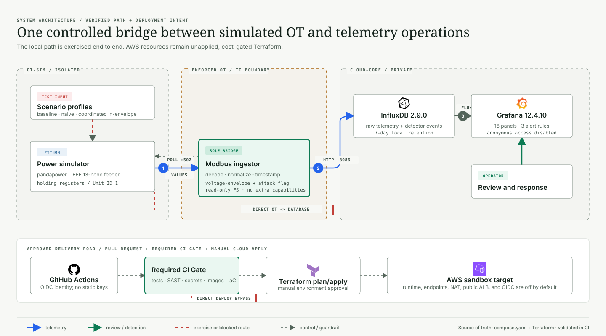
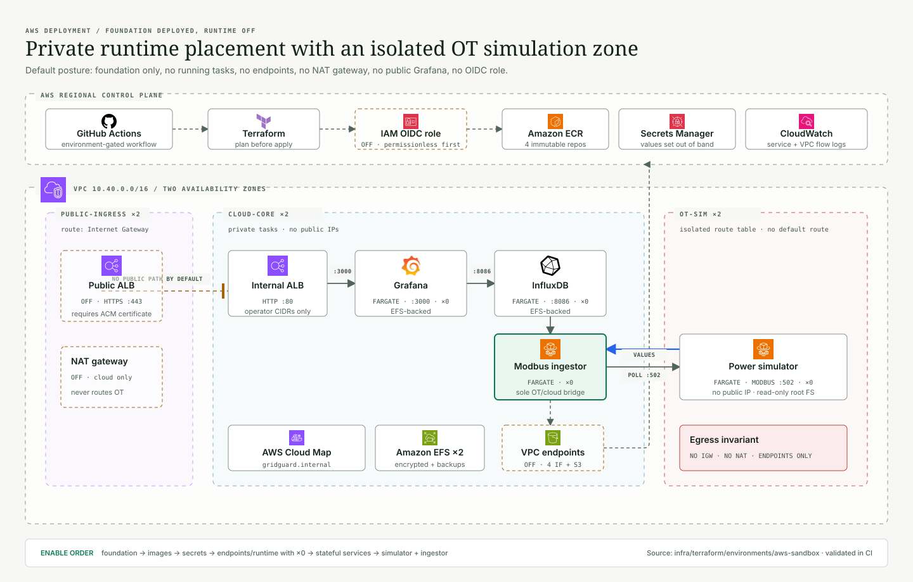
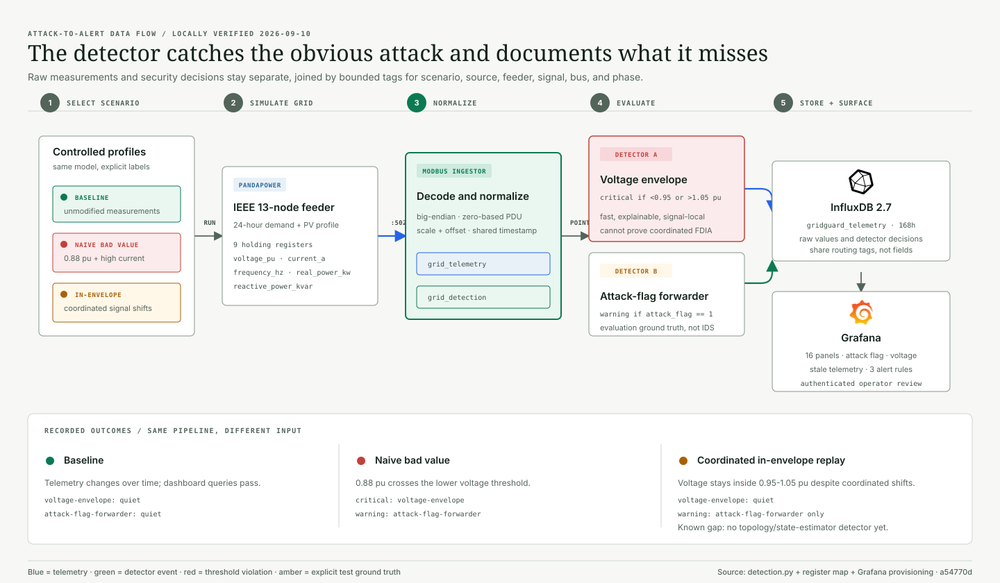

# Architecture and Tech Stack

GridGuard has two architecture states:

- **Locally verified:** the complete simulator-to-dashboard path, including two
  attack replays and their detector outcomes.
- **Terraform-defined, not applied:** an AWS sandbox that maps the same trust
  boundary to concrete resources but defaults all runtime task counts and
  optional cost features off.

The diagrams keep those states explicit. They do not present future work as
already deployed.

## Diagram Set

| View | Answers | Source of truth |
| --- | --- | --- |
| System architecture | What talks to what, and where is the trust boundary? | `compose.yaml` and deployment workflow |
| AWS deployment | Where would each service run, and what is disabled by default? | AWS sandbox Terraform |
| Detection flow | How does a scenario become telemetry, a detection, and an alert? | Python pipeline, register map, and Grafana provisioning |

Design conventions, omissions, icon provenance, and reproduction commands are
recorded in the [diagram asset guide](assets/README.md).

## System Architecture

  

Read the numbered data path from left to right:

1. The Modbus ingestor polls the power simulator on TCP port `502`; register
   values return across the same explicitly allowed boundary.
2. The ingestor decodes the register contract, creates `grid_telemetry` and
   `grid_detection` points, and writes both to InfluxDB over HTTP port `8086`.
3. Grafana queries InfluxDB and presents the dashboard and alert state to an
   authenticated operator.

The ingestor is the only dual-network service locally and the only AWS security
group allowed to initiate traffic into the OT simulation zone. Direct
OT-to-database traffic is not part of either network policy. The delivery path
also requires a pull request, the protected `CI Gate`, and a manual cloud
workflow; no push automatically applies Terraform.

### Local Network Placement

| Zone | Services | Exposure |
| --- | --- | --- |
| `ot-sim` | `power-sim`; optional fixture source | Docker internal network |
| Boundary | `modbus-ingestor-live` or one fixture ingestor | Joins `ot-sim` and `cloud-core` |
| `cloud-core` | InfluxDB and Grafana | Host ports bind to `127.0.0.1` only |

Containers use a read-only root filesystem where the application permits it,
drop all Linux capabilities, enable `no-new-privileges`, use bounded JSON log
rotation, and write only to explicit temporary or persistent mounts.

## AWS Deployment

  

The AWS root creates a VPC spanning two availability zones. Each zone contains
one public-ingress subnet, one cloud-core subnet, and one OT-sim subnet.

### Runtime Placement

| Placement | Resource | Allowed application path |
| --- | --- | --- |
| Cloud-core | Internal Application Load Balancer | Operator CIDRs to listener; listener to Grafana `:3000` |
| Cloud-core | Grafana on ECS/Fargate | Query InfluxDB `:8086`; mount its EFS access point `:2049` |
| Cloud-core | InfluxDB on ECS/Fargate | Accept ingestor and Grafana `:8086`; mount its EFS access point `:2049` |
| Cloud-core | Modbus ingestor on ECS/Fargate | Poll power simulator `:502`; write InfluxDB `:8086` |
| OT-sim | Power simulator on ECS/Fargate | Accept `:502` from the ingestor security group only |

The OT route table has no default Internet Gateway or NAT route. All tasks have
`assign_public_ip = false`. When enabled, interface endpoints provide private
access to ECR API, ECR Docker, CloudWatch Logs, and Secrets Manager; an S3
gateway endpoint supplies ECR image layers.

Cloud Map provides `gridguard.internal` service discovery. InfluxDB and
Grafana each receive an encrypted EFS file system, access point, mount targets
in both cloud subnets, and enabled EFS backups. Runtime secret containers are
created without values; the AWS owner populates the values directly in Secrets
Manager.

### Default-Off Cost and Exposure Gates

| Variable | Default | Effect when enabled |
| --- | --- | --- |
| `enable_runtime` | `false` | Creates ALB, EFS, secret containers, task definitions, Cloud Map, and dormant ECS services |
| `enable_vpc_endpoints` | `false` | Creates four interface endpoints and one S3 gateway endpoint |
| `enable_nat_gateway` | `false` | Adds one NAT gateway for cloud-core HTTPS only |
| `grafana_public` | `false` | Moves the ALB to public subnets and requires an ACM certificate |
| `enable_github_oidc_role` | `false` | Creates the environment-scoped deployment role |
| `desired_counts.*` | `0` | Starts the selected ECS services only after an explicit count change |

An enabled GitHub role has no attached deployment permissions unless the owner
supplies a separately reviewed account-managed policy ARN. A public Grafana ALB
requires HTTPS and an ACM certificate from the selected account and region.
Private operator connectivity to the internal ALB is an account-side design
decision and is not created by this repository.

## Attack and Detection Flow

  

The simulator exposes nine holding registers representing five signal families:
`voltage_pu`, `current_a`, `frequency_hz`, `real_power_kw`, and
`reactive_power_kvar`. The register map fixes Unit ID, addressing, byte order,
word order, type, scale, offset, bus, phase, and quality.

The ingestor emits two independent measurements:

- `grid_telemetry` contains decoded values, quality, and the explicit
  `attack_flag`.
- `grid_detection` contains detector, severity, score, threshold,
  `alert_flag`, and a short decision message.

Both use bounded routing tags for source, scenario, feeder, signal, bus, and
phase. Free-form messages, timestamps, UUIDs, payloads, and credentials do not
belong in tags.

### Implemented Detectors

| Detector | Decision | Meaning |
| --- | --- | --- |
| `voltage-envelope` | Critical below `0.95 pu` or above `1.05 pu` | Explainable value-range check |
| `attack-flag-forwarder` | Warning when `attack_flag == 1` | Preserves scenario ground truth for evaluation; not an independent IDS |
| Grafana stale-telemetry alert | Alert when expected input is absent | Detects a missing stream rather than one bad sample |

### Recorded Outcomes

| Scenario | Voltage detector | Flag forwarder | Interpretation |
| --- | --- | --- | --- |
| Baseline | Quiet | Quiet | Live telemetry and dashboard queries pass |
| Naive bad value | Critical | Warning | `0.88 pu` is detected outside the envelope |
| Coordinated in-envelope replay | Quiet | Warning | The ground-truth flag records the exercise; the static envelope misses it |

The coordinated replay is a deliberate demonstration of a detector limitation.
It is not yet a state-estimator-derived, topology-consistent false-data
injection attack, and GridGuard does not claim that the current detector catches
that class of attack.

## Architecture Invariants

| Invariant | Local enforcement | AWS enforcement |
| --- | --- | --- |
| The simulator remains OT-side | `power-sim` joins only `ot-sim` | ECS service uses isolated OT subnets |
| The ingestor is the only OT/cloud bridge | Only ingestor joins both Compose networks | Only ingestor SG may egress to simulator SG on `:502` |
| Databases remain cloud-side | InfluxDB joins only `cloud-core` | InfluxDB uses cloud subnets; SG accepts only ingestor and Grafana |
| Operator UI is constrained | Ports bind to loopback; anonymous Grafana disabled | Internal ALB by default; CIDR-restricted ingress |
| Workloads do not receive public IPs | Internal Compose networks | Every ECS service sets `assign_public_ip = false` |
| Secrets stay out of code and state | Local ignored environment file | Secret containers in Terraform; values populated out of band |
| Deployments are reviewed | Required `CI Gate` on protected `main` | Manual environment workflow and optional OIDC role |

## Current Tech Stack

| Concern | Implemented choice |
| --- | --- |
| Grid model | Python, pandapower, IEEE 13-node feeder |
| OT protocol | pymodbus, Modbus TCP |
| Contract | Versioned JSON register map |
| Ingestion and detection | Python services |
| Time-series storage | InfluxDB 2.9.0 |
| Dashboards and alerts | Grafana 12.4.10 |
| Local runtime | Docker Compose |
| Cloud runtime definition | AWS ECS/Fargate |
| Infrastructure as code | Terraform |
| CI and deployment | GitHub Actions with OIDC-ready manual deployment |
| Security gates | Ruff, pytest, Bandit, Gitleaks, Trivy, Terraform tests |

## Future Work Not Shown as Implemented

DNP3, mTLS, MQTT or another queue, Suricata or Zeek, Wazuh or ELK, and a
topology/state-estimator detector remain future options. They should enter a
diagram only in the same change that adds their code, configuration, and
verification evidence.

## Next

The next step is the AWS owner's account-side review of a foundation-only
Terraform plan. After the first reviewed apply, capture the actual account,
region, availability zones, resource outputs, and private Grafana access path,
then update the AWS figure from `CODE ONLY` to an as-deployed record.
