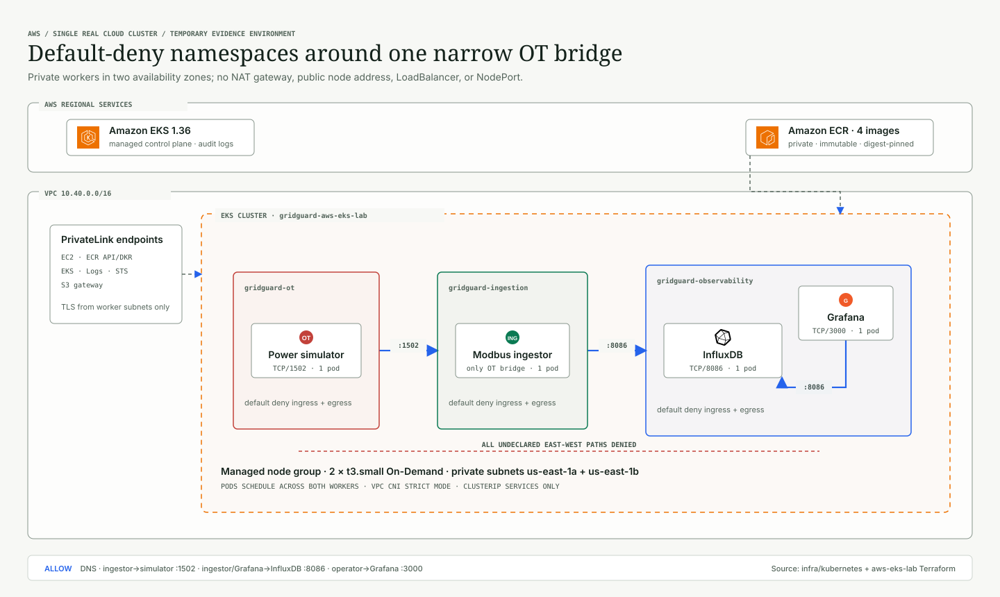

# EKS Segmentation And Evidence

GridGuard adds one temporary Amazon EKS cluster as a distinct evidence target.
The existing AWS ECS deployment proves the original VPC and service-security
group model; EKS proves Kubernetes-native isolation without rewriting that
historical evidence or calling ECS Kubernetes.

## Security Model

Three namespaces model the application trust zones:

- `gridguard-ot` contains only the power simulator.
- `gridguard-ingestion` contains the sole boundary-crossing Modbus ingestor.
- `gridguard-observability` contains InfluxDB and Grafana.

Every namespace has a default-deny ingress-and-egress `NetworkPolicy`. Explicit
policies permit only cluster DNS, ingestor-to-simulator TCP/1502,
ingestor-to-InfluxDB TCP/8086, Grafana-to-InfluxDB TCP/8086, and the labeled
operator path to Grafana TCP/3000. No Kubernetes Service is public.

The EKS-managed Amazon VPC CNI enforces policy in strict startup mode. This is
verified from the live `aws-node` DaemonSet and with connection probes; YAML
presence alone is not accepted as evidence.

## Evidence Standard

The completed evidence package must contain:

1. EKS console cluster overview, version, status, and two-node group.
2. Namespace, deployment, pod, service, and `NetworkPolicy` inventories.
3. VPC CNI add-on version and enabled network-policy agent.
4. Successful allowed-path probes and failed forbidden-path probes.
5. Real `modbus_ingest_ok` application logs.
6. InfluxDB Data Explorer results for `grid_telemetry`.
7. Grafana baseline, naive attack, and stealthy attack views.
8. Detector outputs and Grafana alert-rule state for both attacks.
9. Create and destroy plan checksums, exact Git commit, and image digests.
10. Post-destroy AWS queries and a zero-change Terraform plan.

Raw screenshots and command/API output belong under ignored `tmp/` storage.
The committed deployment record contains only sanitized results, checksums,
and links to non-secret CI evidence.

## Completed Validation

The cloud exercise completed on 2026-09-21. The live single-cluster run proved
strict policy enforcement, all intended allow and deny paths, real
Modbus-to-InfluxDB ingestion, all three scenarios, all 15 Grafana panels, and
all three alert rules. The final Terraform plan reported no drift.

See the
[sanitized EKS validation record](deployment-records/2026-09-21-aws-eks-segmentation.md)
for exact results, evidence hashes, execution remediations, and the remaining
teardown action. The UI evidence and conclusions are assembled in the
[technical report](GridGuard-Technical-Report.md).

The full lifecycle, cost boundary, bootstrap changes, commands, and teardown
criteria are in the
[EKS Terraform runbook](../infra/terraform/environments/aws-eks-lab/README.md).
