# GridGuard Cloud-Native SCADA Security Lab

**Technical Report**<br>
**Validated:** 21 September 2026<br>
**AWS region:** `us-east-1`<br>
**Evidence commit:** `e45e2dd7c7e3b3b4f4ef42a29cb29355bb747f2f`

## Executive Summary

GridGuard is a reproducible cyber-physical lab that solves a time-varying
distribution-feeder approximation, publishes SCADA-style measurements over
Modbus TCP, ingests them into InfluxDB, visualizes operations in Grafana, and
tests false-data injection detection. The final deployment ran on one real
Amazon EKS cluster with two private workers in separate availability zones.

The validation proved both functionality and isolation. Every required
workload became healthy, real Modbus telemetry reached InfluxDB, all 15
dashboard panels and three alert rules passed, intended service paths
succeeded, and forbidden cross-zone paths failed. Baseline, obvious
out-of-envelope, and coordinated in-envelope scenarios were replayed and
captured in both InfluxDB and Grafana.

The work does not claim an external SIEM, network IDS, service-to-service mTLS,
or state-estimator-derived stealth attack detector. Those remain explicit
future work. The report distinguishes demonstrated controls from roadmap
items.

## 1. Objectives And Scope

The project set five required outcomes:

1. Deploy a working cloud-hosted distribution-grid digital twin.
2. Preserve an explicit OT/IT trust boundary.
3. demonstrate at least two false-data injection scenarios and their detection
   behavior.
4. Make infrastructure and application deployment reproducible.
5. Produce reviewable, integrity-protected technical evidence.

The power model is a balanced approximation built from the IEEE 13-node feeder
topology and solved with `pandapower`. It uses deterministic 24-hour demand and
PV profiles. It is suitable for this integration lab, but it is not presented
as a calibrated unbalanced IEEE reference implementation.

## 2. System Architecture


The simulator is the OT-side data source. The Modbus ingestor is the only
component allowed to cross into the ingestion zone. It polls TCP/1502, maps
registers to the documented telemetry contract, creates detection records, and
writes to InfluxDB. Grafana reads InfluxDB and provides the operator view and
three provisioned alert rules.

The deployed Kubernetes design used three namespaces:

| Trust zone | Workloads | Permitted application paths |
| --- | --- | --- |
| `gridguard-ot` | Power simulator | Receives Modbus only from the ingestor |
| `gridguard-ingestion` | Modbus ingestor | DNS, simulator TCP/1502, InfluxDB TCP/8086 |
| `gridguard-observability` | InfluxDB, Grafana | Grafana-to-InfluxDB TCP/8086; labeled operator-to-Grafana TCP/3000 |


Each namespace had default-deny ingress and egress. Amazon VPC CNI policy
enforcement ran in strict startup mode. The cluster had no public workloads,
NAT gateway, or public worker addresses. Private VPC endpoints supplied AWS
control-plane and image-registry access.

## 3. Implementation And DevSecOps Controls

Application images are immutable and digest-pinned. Workloads run without
privilege, with read-only root filesystems where supported, dropped Linux
capabilities, seccomp runtime defaults, and exact numeric UIDs/GIDs. Secrets
are created ephemerally from an ignored local environment file and are never
stored in Git or captured in evidence.

Terraform defines the EKS cluster, managed node group, IAM roles, encryption,
logging, private subnets, and endpoints. CloudFormation bootstraps narrowly
scoped deployment identities. GitHub Actions runs repository hygiene,
documentation checks, Python lint/test/SAST/audit, Terraform validation,
Kubernetes policy validation, container scanning, CodeQL, secret scanning,
and workflow-policy checks. Infrastructure apply remains an explicit local
operator action using short-lived credentials and reviewed saved plans.

## 4. Cloud Deployment Result

The live cluster `gridguard-aws-eks-lab` reported `ACTIVE` on Kubernetes
`1.36`. Its node group reported `ACTIVE` with an empty issue list and exactly
two On-Demand `t3.small` workers. One worker ran in `us-east-1a`, the other in
`us-east-1b`; neither had a public IP.

The API endpoint supported private access and temporarily allowed public
access only from `196.117.93.106/32`. API, audit, and authenticator logging was
enabled. Six private-DNS interface endpoints covered EKS, EC2, ECR API, ECR
Docker, CloudWatch Logs, and STS; an S3 gateway endpoint completed the private
image path.

The final Terraform detailed-exit plan returned code `0` with `No changes`,
showing that the live infrastructure matched the reviewed configuration.

## 5. AWS Console Evidence

The following authenticated AWS Console captures complement the checksummed
API responses. The EKS overview shows the active `1.36` cluster and zero
reported cluster, node-health, or capability issues. The compute page shows
the active managed node group at desired size two.

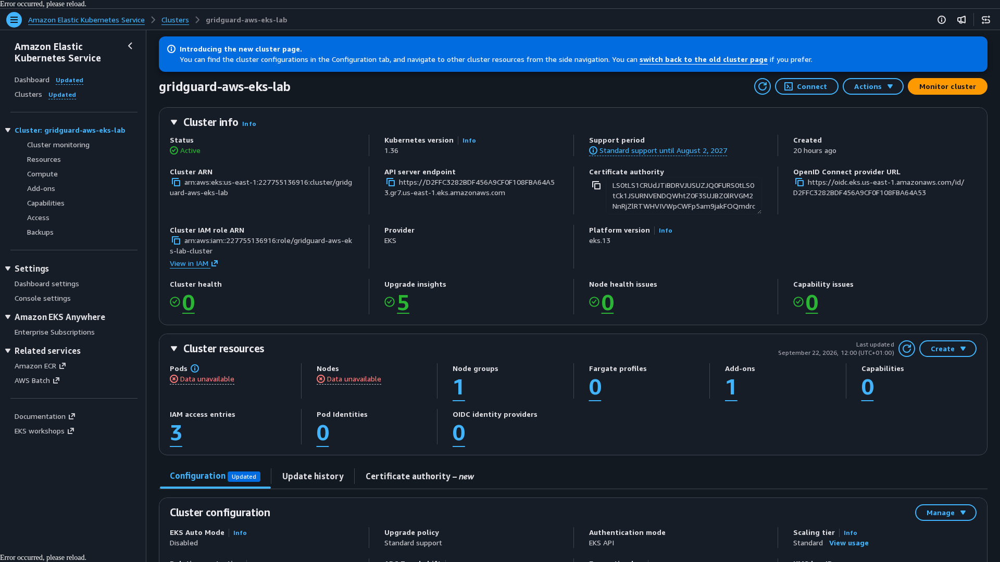

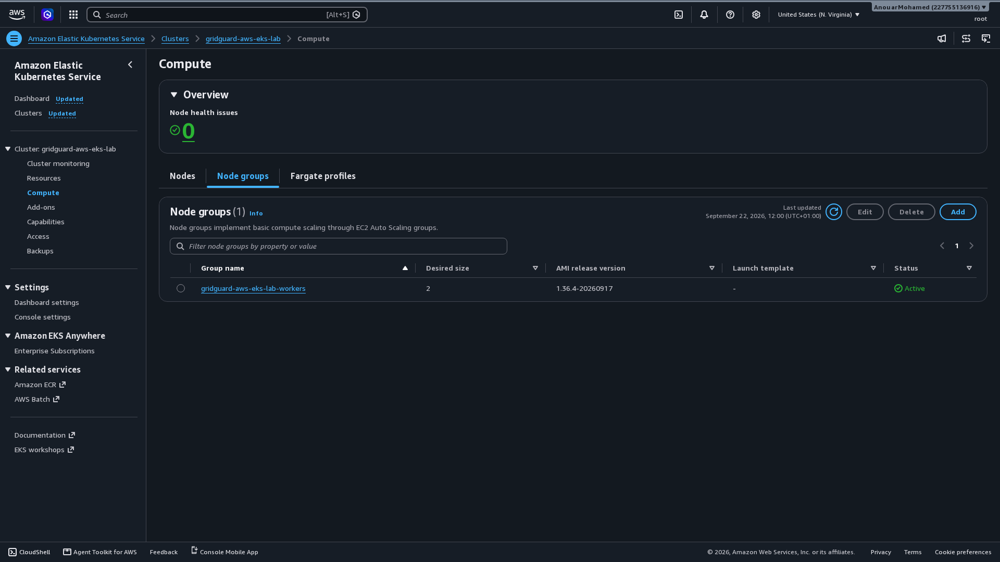

The VPC CNI add-on is active at `v1.23.1-eksbuild.1`. The control-plane logging
configuration shows API server, audit, and authenticator logging enabled while
controller-manager and scheduler logging remain disabled by design.

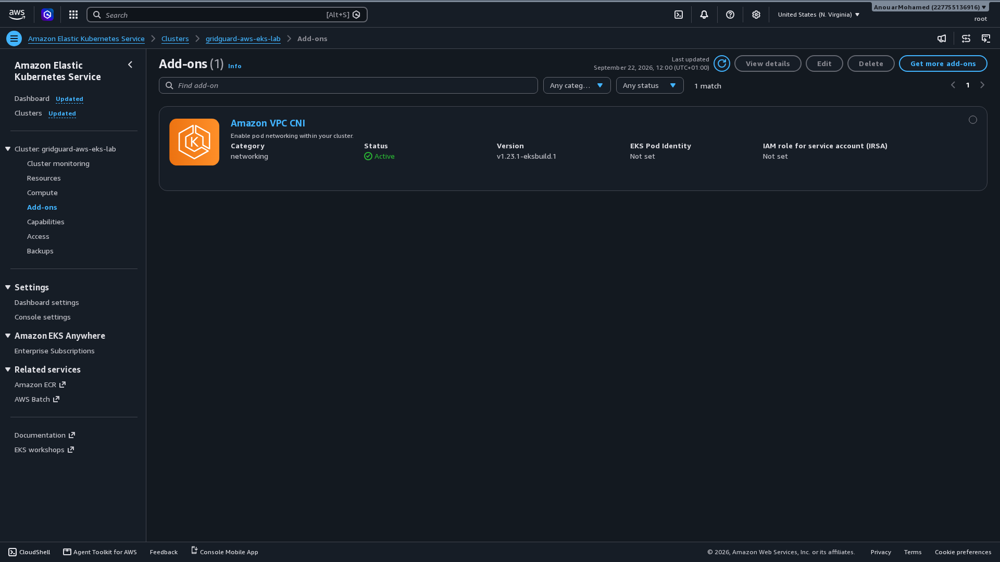

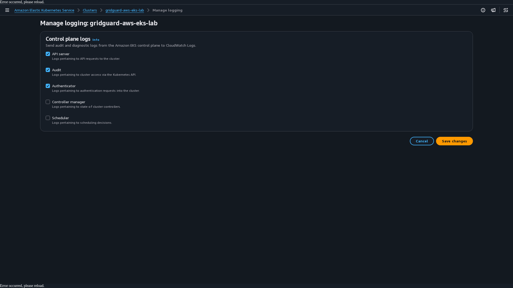

The EC2 inventory shows exactly two running `t3.small` workers across
`us-east-1a` and `us-east-1b`, with values only in the private IPv4 column and
blank public IPv4 columns. The VPC inventory shows the six inherited sandbox
subnets; EKS uses the isolated `10.40.10.0/24` and `10.40.11.0/24` pair.

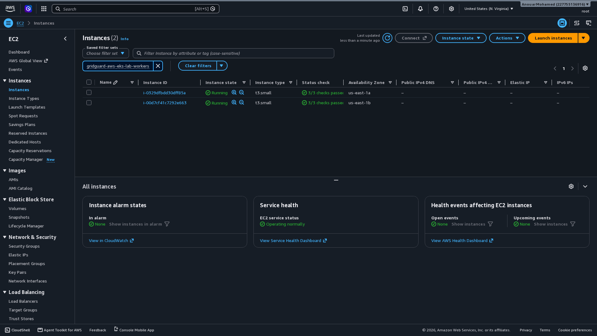

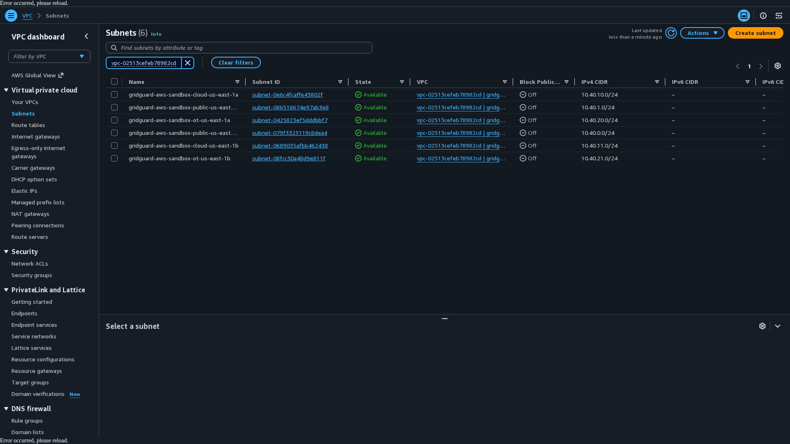

All seven EKS-required VPC endpoints report `Available`. The security-group
inventory shows separate EKS node and endpoint groups alongside the retained
ECS foundation groups; namespace isolation is independently proven by the
live Kubernetes deny probes.

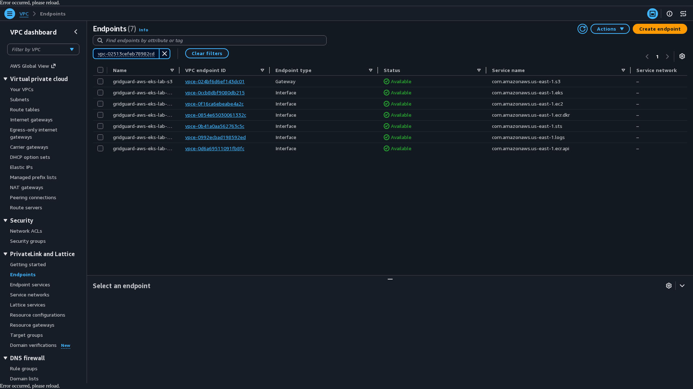

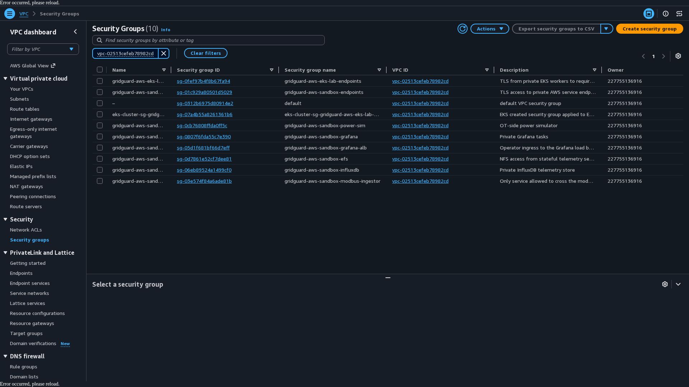

## 6. Segmentation Verification

The final automated run proved:

| Test | Expected | Observed |
| --- | --- | --- |
| Ingestor to power simulator | Allow | Passed |
| Untrusted pod to power simulator | Deny | Passed |
| Grafana to power simulator | Deny | Passed |
| Ingestor to InfluxDB | Allow | Passed |
| Grafana to InfluxDB | Allow | Passed |
| Power simulator to InfluxDB | Deny | Passed |
| Untrusted pod to InfluxDB | Deny | Passed |
| Modbus-to-InfluxDB application flow | Allow | Passed |

The same run checked VPC CNI strict mode, the active network-policy agent,
InfluxDB and Grafana health, the telemetry schema, all dashboard panels, and
all alert definitions. It observed 4,041 stored value rows in the archived
run.

## 7. Baseline Scenario

The baseline produced 540 fresh points with `attack_flag=0` and zero detection
records. Grafana showed a clear attack state and voltage inside the expected
envelope.

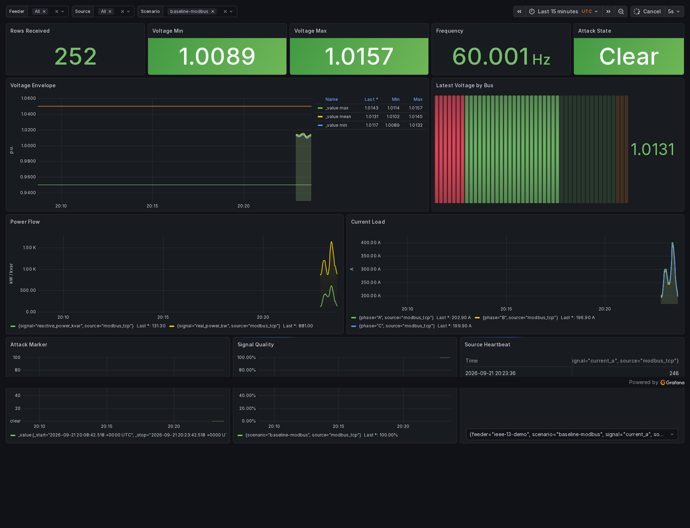

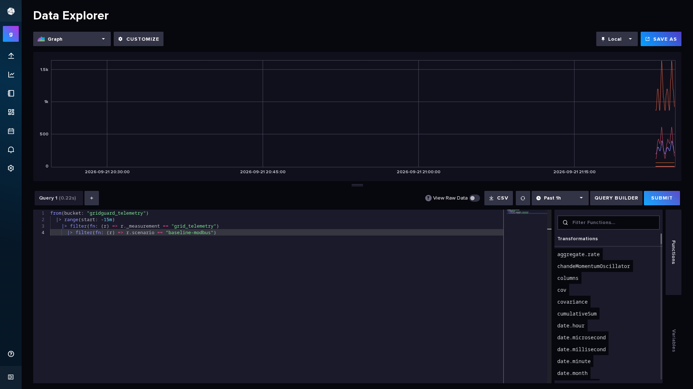

## 8. Naive False-Data Injection

The naive replay forced phase-A voltage to `0.88 pu` and increased phase-A
current by 45 percent. The cloud run produced 135 fresh attack points and ten
detections per ingestion cycle. The voltage-envelope detector and forwarded
ground-truth flag both identified the replay.

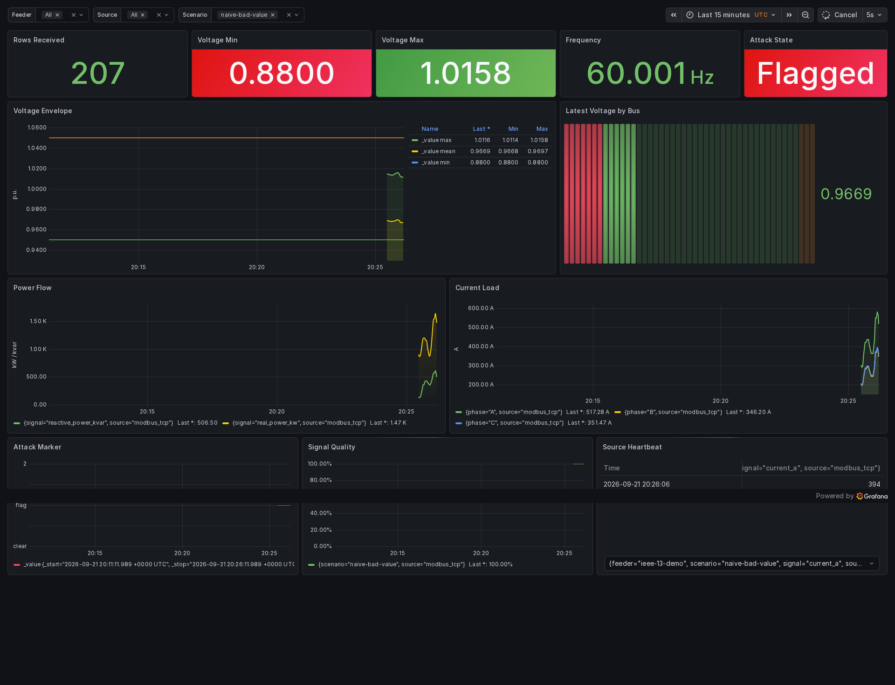


## 9. Coordinated In-Envelope Replay

The stealthy replay shifted voltage by `0.012 pu` and increased current and
power coherently by four percent. The cloud run produced 135 fresh attack
points and nine ground-truth flag detections per cycle. The values remained
inside the simple voltage envelope, so that detector did not independently
identify the manipulation. This result demonstrates the weakness of static
thresholds and motivates residual or state-estimation detection.

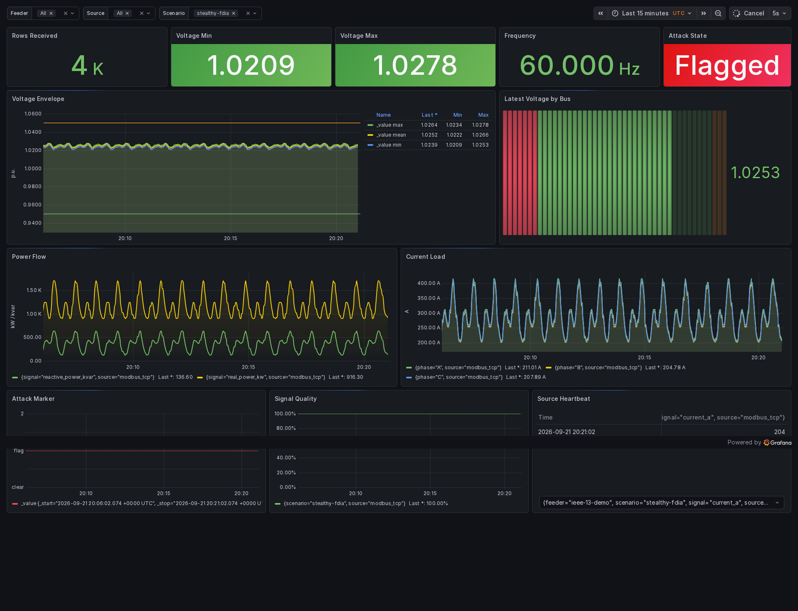

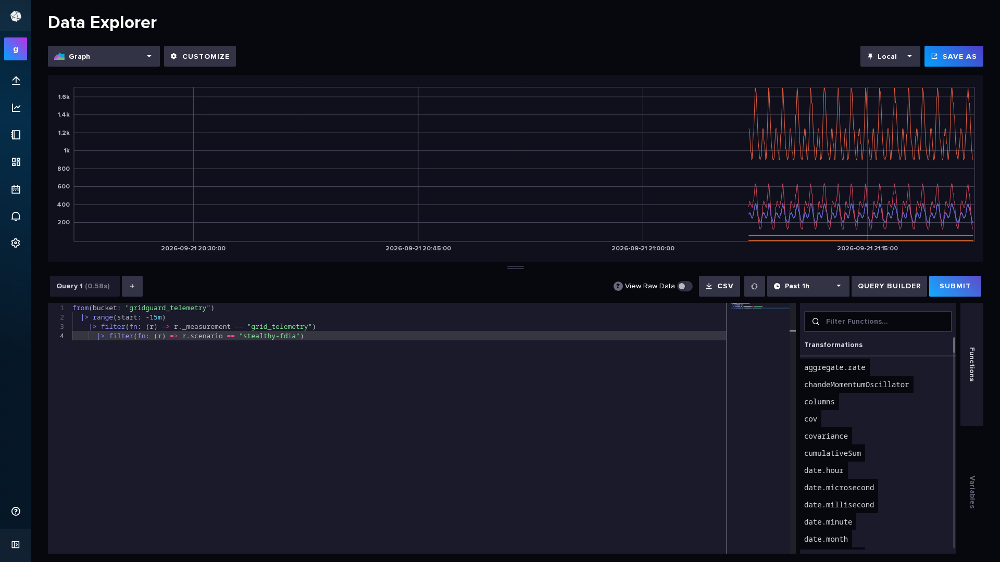

## 10. Evidence And Reproducibility

The ignored evidence archive is identified by run ID `20260921T203903Z` and
SHA-256:

```text
9efc81670cb9aa38d7a13dd68489dd8d5110cff1db3f169dbaaa4877fbe3c9f2
```

Its 20-file manifest covers AWS API responses, Kubernetes inventories,
policy-endpoint status, six UI captures, the complete smoke transcript, the
zero-drift Terraform transcript, and Git/time metadata. The manifest passed
`sha256sum -c`. Raw cloud metadata remains outside Git because it contains
account and infrastructure identifiers; the six report images contain no
credentials.

The supplementary authenticated AWS Console archive is
`eks-aws-console-20260922.tar.gz`, SHA-256
`8b933e8457218ab88733bab52ae6a3ff574174fb28b6a468a07a135ed385743f`.
Its own manifest verifies eight console captures plus capture time. The
versioned report assets are cropped only where needed for readable page
composition; no values were altered.

The complete sanitized execution record is
[AWS EKS Segmentation Validation Record](deployment-records/2026-09-21-aws-eks-segmentation.md).

## 11. Execution Findings And Remediation

The exercise exposed four useful implementation defects. The initial node
group lacked read access to five AWS-owned EKS system-image repositories; the
permissions boundary was extended only with read actions for those exact
repositories. Strict startup isolation blocked CoreDNS until a dedicated
minimum policy admitted node probes, the Kubernetes API VIP, and the VPC
resolver. Workloads were then pinned to exact numeric runtime identities. The
smoke test was updated for the current VPC CNI agent name and corrected to
avoid a long-log `pipefail` false negative.

Each change was validated locally, passed protected CI, merged independently,
and rechecked against the live cluster.

## 12. Limitations And Future Work

- Calibrate the balanced feeder approximation against published IEEE
  reference results or adopt an unbalanced model.
- Add a residual or state-estimation detector capable of independently
  assessing coordinated in-envelope manipulation.
- Add a true network IDS and external SIEM integration if those become scope
  requirements.
- Add service-to-service mTLS only after choosing an identity and certificate
  lifecycle appropriate to the lab.
- Replace the temporary public EKS API allowlist with a private operator access
  path for long-lived use.

## 13. Conclusion

GridGuard met the bounded lab objectives: a real cloud Kubernetes deployment,
an explicit OT/IT boundary, live industrial-protocol telemetry, time-series
storage, operational dashboards, two repeatable attack scenarios, detection
evidence, infrastructure as code, and a checksummed audit trail. The design
also makes its limitations visible instead of presenting roadmap controls as
implemented security.

At report generation time the EKS lab remained live solely for final review.
Controlled Terraform teardown and post-destroy verification are the next
operational actions.
